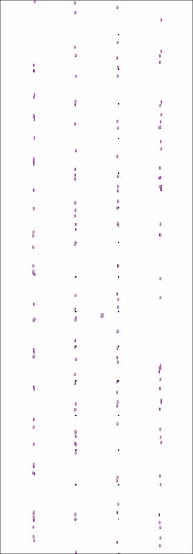

<div align="center">
  
</div>
<p align="center">
  🚀 A High-Performance FPGA Placement and Routing Framework Powered by <a href="https://github.com/pytorch/pytorch">PyTorch</a>
</p>

<p align="center">
  <strong>State-of-the-Art</strong> &nbsp;|&nbsp; <strong>GPU-Accelerated</strong> &nbsp;|&nbsp; <strong>Production-Ready</strong>
</p>

## Table of Contents

- [Overview](#overview)
- [Key Features](#key-features)
- [Latest Updates](#latest-updates)
- [Visual Demo](#visual-demo)
- [Getting Started](#getting-started)
  - [Prerequisites](#prerequisites)
  - [Installation](#installation)
  - [Running Benchmarks](#running-benchmarks)
- [Documentation](#documentation)
- [Resources](#resources)
- [Team & Contributors](#team--contributors)
- [Publications](#publications)
- [License](#license)

## Overview

OpenPARF is a cutting-edge FPGA placement and routing framework that delivers superior performance through innovative algorithms and GPU acceleration. Our framework achieves up to 12.7% improvement in routed wirelength and 2X+ speedup in placement compared to state-of-the-art solutions.

## Key Features

- 🔋 **Advanced Placement Technology**
  - Multi-Electrostatic-based placement engine
  - Multi-die FPGA support with SLL count optimization
  - Comprehensive unit support (LUT, FF, DSP, BRAM, IO, etc.)

- ⚡ **High Performance**
  - GPU acceleration via CUDA
  - 0.4-12.7% better routed wirelength
  - 2X+ faster placement speed

- 🛠 **Production Ready**
  - Industry-standard architecture support
  - Extensive benchmarking suite
  - Well-documented API and examples

## Latest Updates

🎉 **OpenPARF 2.0 Release** (2024/02/02)
- Multi-die FPGA placement support
- Flexshelf architecture format
- Performance improvements and bug fixes
- [Release Notes](https://github.com/PKU-IDEA/OpenPARF/releases/tag/2.0.0)

## Visual Demo

Experience the power of our electrostatic field-based placement through these visualizations from benchmark `ISPD2016/FPGA06`:

|            **LUT**            |           **FF**            |            **DSP**            |            **BRAM**             |
| :---------------------------: | :-------------------------: | :---------------------------: | :-----------------------------: |
|  |  |  |  |

## Getting Started

### Prerequisites
- Python 3.7+
- C++14 compatible compiler
- PyTorch 1.7.1
- CUDA 11.0 (for GPU acceleration)
- Gurobi 9.5 (optional)

### Installation

```bash
# Create conda environment
mamba create --name openparf python=3.7
mamba activate openparf

# Install dependencies
mamba install cmake boost bison
mamba install pytorch==1.7.1 torchvision==0.8.2 cudatoolkit=11.0 -c pytorch
pip install hummingbird-ml pyyaml networkx tqdm

# Build OpenPARF
git clone --recursive https://github.com/PKU-IDEA/OpenPARF.git
mkdir build && cd build
cmake .. -DCMAKE_PREFIX_PATH=$CONDA_PREFIX -DPYTHON_EXECUTABLE=$(which python) -DCMAKE_INSTALL_PREFIX=../install
make -j8 && make install
```

For detailed installation instructions, see [INSTALL.md](INSTALL.md).

### Running Benchmarks

```bash
cd ../install
python openparf.py --config unittest/regression/ispd2016/FPGA01.json
```

For more benchmark information, see [BENCHMARKS.md](BENCHMARKS.md).

## Documentation

- 📘 [Installation Guide](INSTALL.md)
- 📗 [Benchmark Guide](BENCHMARKS.md)
- 📙 [Architecture Customization](ARCHITECTURE.md)

## Resources

- [ISPD 2016 Contest](http://www.ispd.cc/contests/16/ispd2016_contest.html)
- [ISPD 2017 Contest](http://www.ispd.cc/contests/17/)

## Team & Contributors

OpenPARF is developed and maintained by [PKU-IDEA Lab](https://github.com/PKU-IDEA) at Peking University, under the supervision of [Prof. Yibo Lin](https://yibolin.com/).

**Core Contributors:**
- [Jing Mai](https://magic3007.github.io/), [Jiarui Wang](https://tomjerry213.github.io/) and [Yibai Meng](https://www.mengyibai.com/) - Initial release
- Runzhe Tao - Multi-die placement integration
- [Jing Mai](https://magic3007.github.io/), [Jiarui Wang](https://tomjerry213.github.io/), Yifan Chen, [Zizheng Guo](https://guozz.cn), Xun Jiang, [Yun Liang](https://ericlyun.github.io), [Yibo Lin](https://yibolin.com/) - OpenPARF 3.0 with macro placement

## Publications

For academic papers and citations, please see our [publications list](PUBLICATIONS.md).

## License

OpenPARF is released under the BSD 3-Clause License. See [LICENSE](LICENSE) for details.
