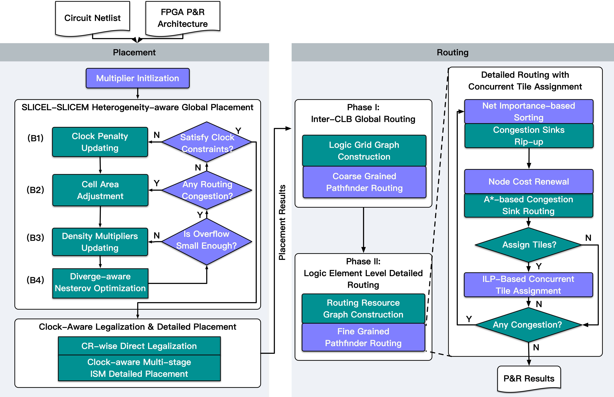

# OpenPARF

🕹 OpenPARF is an open-source FPGA placement and routing framework build upon the deep learning toolkit [PyTorch](https://github.com/pytorch/pytorch). It is designed to be flexible, efficient, and extensible.

<!-- toc -->

- [OpenPARF](#openparf)
  - [More About OpenPARF](#more-about-openparf)
    - [A Multi-Electrostatic-based FPGA P\&R Framework](#a-multi-electrostatic-based-fpga-pr-framework)
    - [Reference Flow](#reference-flow)
    - [Demo](#demo)
  - [Installation](#installation)
    - [From Source](#from-source)
      - [Prerequisites](#prerequisites)
      - [Install Dependencies](#install-dependencies)
      - [Get the OpenPARF Source](#get-the-openparf-source)
      - [Install OpenPARF](#install-openparf)
      - [Adjust Build Options (Optional)](#adjust-build-options-optional)
  - [Getting Started](#getting-started)
    - [ISPD 2016/2017 Benchmarks](#ispd-20162017-benchmarks)
      - [Obtaining Benchmarks](#obtaining-benchmarks)
      - [Running the Benchmarks](#running-the-benchmarks)
      - [Adjust Benchmark Options (Optional)](#adjust-benchmark-options-optional)
      - [More Advanced Usages](#more-advanced-usages)
        - [Running Benchmarks in Batches](#running-benchmarks-in-batches)
        - [Vivado Flow for Placement Evaluation](#vivado-flow-for-placement-evaluation)
  - [Resources](#resources)
  - [Releases and Contributing](#releases-and-contributing)
  - [The Team](#the-team)
  - [Publications](#publications)
  - [License](#license)

<!-- tocstop -->

## More About OpenPARF

OpenPARF is an open-source framework for FPGA rapid placement and routing, which can run on both CPU and GPU. OpenPARF provides a number of APIs to enable researchers to quickly prototype their own FPGA algorithms and evaluate their performance on real FPGA hardware.

At a granular level, OpenPARF is a framework that consists of the following components:

|    **Component**     |                                  **Description**                                  |
| :------------------: | :-------------------------------------------------------------------------------: |
|      `openparf`      |                        The core placement and routing tool                        |
|    `openparf.ops`    | A collection of operators that allow the implementation of various P&R algorithms |
| `openparf.placement` |                   A set of APIs for performing placement tasks                    |
|  `openparf.routing`  |                    A set of APIs for performing routing tasks                     |
| `openparf.py_utils`  |              Provides other utility functions for Python convenience              |

OpenPARF provides a compilation stack to integrate your placement and routing algorithms into operators that can be used in Python. You can extend OpenPARF as needed, making it the ideal environment for FPGA optimization enthusiasts.

Elaborating Further:

### A Multi-Electrostatic-based FPGA P&R Framework

OpenPARF is a powerful FPGA P&R framework that utilizes a multi-electrostatic-based approach to achieve optimal results with respect to routed wirelength and placement speed. OpenPARF supports the following features:

```
- A wide range of logical unit types including LUT, FF, DSP, BRAM, IO, Distributed RAM, and Shift Register
- Support for SLICEL and SLICEM CLB heterogeneous types
- Clock routing constraints
- ...
```

OpenPARF has proven to be a powerful tool, outperforming the state-of-the-art academic FPGA P&R tools in terms of wired length and placement speed. With a `0.4-12.7%` improvement in routed wirelength and a speedup of over `2X` in placement, OpenPARF is a highly efficient FPGA P&R framework that offers optimized results with minimal manual intervention.

### Reference Flow



### Demo

The following are the visualization for electrostatic fields in benchmark `ISPD2016/FPGA06`.

|            **LUT**            |           **FF**            |            **DSP**            |            **BRAM**             |
| :---------------------------: | :-------------------------: | :---------------------------: | :-----------------------------: |
|  |  |  |  |

## Installation

### From Source

#### Prerequisites

If you are installing from source, you will need:

- Python 3.7 or above
- C++ compiler with C++14 support, recommended to use GCC 7.5. Other version may also work, but have not been tested.
- PyTorch 1.7.1. Other version may also work, but have not been tested. Please refer to the [next section](#install-dependencies) to install PyTorch through conda environment.
- Gurobi 9.5, other version may also work, but have not been tested. Please make sure to obtain a valid license and follow the installation instructions provided on the Gurobi website.
- NVIDIA CUDA 11.0 (optional, if compiled with CUDA support). Other versions may also work, but have not been tested. If CUDA is found, the project can run on the GPU implementation, otherwise it will only run on the CPU implementation.

#### Install Dependencies

We highly recommend installing an [Anaconda](https://www.anaconda.com/data-science-platform#download-section) or [Mamba](https://github.com/mamba-org/mamba) environment. You will get controlled dependency versions regardless of your Linux distro.

```bash
# * create and activate conda environment
conda create --name openparf python=3.7
conda activate openparf

# * common packages
conda install cmake boost bison

# * Pytorch 1.7.1. Other version may also work, but have not been tested.
conda install pytorch==1.7.1 torchvision==0.8.2 cudatoolkit=11.0 -c pytorch

# * python packages
pip install hummingbird-ml pyyaml
```

#### Get the OpenPARF Source

```bash
git clone --recursive https://github.com/PKU-IDEA/OpenPARF.git
```

#### Install OpenPARF

Assuming that OpenAPRF is a subfolder in the current directory, i.e., `./OpenPARF` is the path to the OpenPARF source code.

```bash
mkdir build
cd build
cmake ../OpenPARF -DCMAKE_PREFIX_PATH=$CONDA_PREFIX -DPYTHON_EXECUTABLE=$(which python) -DPython3_EXECUTABLE=$(which python) -DCMAKE_INSTALL_PREFIX=<installation directory>
make -j8
make install
```

Where `<installation directory>` is the directory where you want to install OpenPARF (e.g., `../install`).

#### Adjust Build Options (Optional)

You can adjust the configuration of cmake variables optionally (without buiding first), by doing the following.

- `CMAKE_INSTALL_PREFIX`: The directory where you want to install OpenPARF (e.g., `../install`).
- `CMAKE_BUILD_TYPE`: The build type, can be `Release` or `Debug`. Default is `Release`.
- `USE_CCACHE`: Whether to use ccache to speed up compilation. Default is `OFF`.

## Getting Started

### ISPD 2016/2017 Benchmarks

#### Obtaining Benchmarks

To obtain the benchmarks, you can download the benchmark zip files from the provided Google Drive links. There are separate links for ISPD 2016 and ISPD 2017 FPGA Placement Benchmarks.

- [ISPD 2016 FPGA Placement Benchmarks](https://drive.google.com/file/d/1kzg0NfEmJvwzhJADPE_Q0UjS6UpVCMZZ/view?usp=share_link)

- [ISPD 2017 FPGA Placement Benchmarks](https://drive.google.com/file/d/1Uf9qIZ8WL_jk03sIlAoS9dIrvYH3d1pz/view?usp=sharing)

> <details>
> <summary> 💡 Toggle to see how to download files from Google Drive in command line</summary>
>
> 1. Click on the download button in the browser (e.g. Chrome)
>
> 2. Copy the download link from the browser
>
> 3. Use the curl command in the terminal to download the file
>
> ```bash
> curl <url> --output <output filename>
> ```
>
> </details>

Once the files have downloaded, extract their contents to the `<installation directory>/benchmarks` folder. You should then have two new directories, one for ISPD 2016 and another for ISPD 2017. Remember to keep these benchmark directories separate as OpenPARF supports ISPD2016 and ISPD2017 benchmarks.

```bash
<installation directory>/benchmarks
├── ispd2016
├── ispd2017
```

#### Running the Benchmarks

To run the benchmarks, navigate to the installation directory and execute the following command:

```bash
cd <installation directory>
python openparf.py --config unittest/regression/ispd2016/FPGA01.json
```

Note that the `openparf.py` script requires the `--config` option to specify the configuration file to use. The appropriate configuration file for the benchmark should exist in the corresponding directory (`unittest/regression/ispd2016/`) before running the command. Other benchmarks can also be run by selecting the appropriate configuration from their respective directory such as `unittest/regression/ispd2016` and `unittest/regression/ispd2017`.

It is essential to ensure all dependencies and the Python environment have been correctly set up before running the command. Once everything is in order, the benchmark will commence, and the outcomes will be sent to the output directory.

#### Adjust Benchmark Options (Optional)

OpenPARF allows configuration of benchmark parameters using JSON. Default parameters can be found in `openparf/params.json`, while users can use `--config` to pass custom parameters which will override defaults. For example:

```bash
python openparf.py --config unittest/regression/ispd2016/FPGA01.json
```

The parameter configuration in `unittest/regression/ispd2016/FPGA01.json` will override the defaults in `openparf/params.json`.

Common modifiable parameters include

- `gpu`: Enable GPU acceleration or not. Default is 0.
- `result_dir`: Specify the directory to save P&R results.
- `route_flag`: Enable routing or not. Default is 0.

For more detailed information on parameters, please see the `description` field in `openparf/params.json`.

#### More Advanced Usages

More advanced usages are available to customize the benchmark run.

##### Running Benchmarks in Batches

We also provide scripts to run ISPD2016 and ISPD2017 in batches. Navigate to the installation directory and execute the following commands:

```bash
cd <installation directory>
# ispd 2016
<source directory>/scripts/run_ispd2016_benchmark.sh
# ispd 2017
<source directory>/scripts/run_ispd2017_benchmark.sh
```

The results can be found in `<installation directory>/../ispd2016_log` and `<installation directory>/../ispd2017_log`, respectively. Please refer to the script for specific configurations.

##### Vivado Flow for Placement Evaluation

If you are looking to evaluate a placement algorithm, you can do so directly with OpenPARF. Alternatively, you can import the placement results from OpenPARF into Vivado for evaluation. This is particularly useful if you are competing in the ISPD [2016](https://www.ispd.cc/contests/16/Flow.txt)/[2017](https://www.ispd.cc/contests/17/Flow.txt) contest and want to use the Vivado flow for placement evaluation. The official websites for ISPD offer instructions on how to load the placement results into the Vivado flow.

When you import the OpenPARF placement result file into Vivado, it will be located in `<result dir>/<benchmark name>.pl` (e.g., `results/FPGA01/FPGA01.pl`). Keep in mind that the `<result dir>` and `<benchmark name>` are parameters set within the JSON configuration.

NOTE that if you want the evaluate the placement via Vivado, you can disable the routing stage in OpenPARF by simply setting the `route_flag` to 0 before running the tool.

## Resources

- [ISPD 2016: Routability-Driven FPGA Placement Contest](http://www.ispd.cc/contests/16/ispd2016_contest.html)
  - Official ISPD 2016 FPGA Placement benchmarks can be downloaded from [here](https://www.ispd.cc/contests/17/downloads/2016/index.html).
- [ISPD 2017: Clock-Aware FPGA Placement Contest](http://www.ispd.cc/contests/17/)

## Releases and Contributing

We appreciate all contributions. If you are planning to contribute back bug-fixes, please do so without any further discussion.

If you plan to contribute new features, utility functions or extensions, please first open an issue and discuss the feature with us. Sending a PR without discussion might end up resulting in a rejected PR, because we might be taking the core library in a different direction than you might be aware of.

## The Team

OpenPARF is maintained by [PKU-IDEA Lab](https://github.com/PKU-IDEA) at Peking University, supervised by [Prof. Yibo Lin](https://yibolin.com/).

- [Jing Mai](https://magic3007.github.io/), [Jiarui Wang](https://tomjerry213.github.io/) and [Yibai Meng](https://www.mengyibai.com/) composed the initial release.

## Publications
- [Jing Mai](https://magic3007.github.io/), [Jiarui Wang](https://tomjerry213.github.io/), [Zhixiong Di](http://www.dizhixiong.cn/), [Guojie Luo](https://scholar.google.com/citations?user=8-mT29YAAAAJ&hl=en), [Yun Liang](https://ericlyun.github.io/) and [Yibo Lin](https://yibolin.com/), "**OpenPARF: An Open-Source Placement and Routing Framework for Large-Scale Heterogeneous FPGAs with Deep Learning Toolkit**", _arXiv preprint [arXiv: 2306.16665](https://arxiv.org/abs/2306.16665)_, 2023.
- [Jing Mai](https://magic3007.github.io/), [Yibai Meng](https://www.mengyibai.com/), [Zhixiong Di](http://www.dizhixiong.cn/), and [Yibo Lin](https://yibolin.com/), “**Multi-electrostatic FPGA placement considering SLICEL-SLICEM heterogeneity and clock feasibility**,” in _Proceedings of the 59th ACM/IEEE Design Automation Conference (DAC)_, San Francisco California: ACM, Jul. 2022, pp. 649–654. doi: [10.1145/3489517.3530568](https://doi.org/10.1145/3489517.3530568).
- [Jiarui Wang](https://tomjerry213.github.io/), [Jing Mai](https://magic3007.github.io/), [Zhixiong Di](http://www.dizhixiong.cn/), and [Yibo Lin](https://yibolin.com/), “**A Robust FPGA Router with Concurrent Intra-CLB Rerouting**,” in _Proceedings of the 28th Asia and South Pacific Design Automation Conference (ASP-DAC)_, Tokyo Japan: ACM, Jan. 2023, pp. 529–534. doi: [10.1145/3566097.3567898](https://doi.org/10.1145/3566097.3567898).
<details><summary>CLICK ME to show the bibtex.</summary>

<p>

```bibtex
@article{PLACE_ARXIV22_Mai_OpenPARF,
  title   = {OpenPARF: An Open-Source Placement and Routing Framework for Large-Scale Heterogeneous FPGAs with Deep Learning Toolkit},
  author  = {Jing Mai and Jiarui Wang and Zhixiong Di and Guojie Luo and Yun Liang and Yibo Lin},
  year    = {2023},
  journal = {arXiv preprint arXiv: 2306.16665}
}

@inproceedings{PLACE_DAC22_Mai,
  title        = {Multi-electrostatic {FPGA} placement considering {SLICEL-SLICEM} heterogeneity and clock feasibility},
  author       = {Jing Mai and Yibai Meng and Zhixiong Di and Yibo Lin},
  booktitle    = {ACM/IEEE Design Automation Conference (DAC)},
  pages        = {649--654},
  year         = {2022},
}

@inproceedings{ROUTE_ASPDAC2023_Wang,
  title     = {{{A Robust FPGA Router with Concurrent Intra-CLB Rerouting}}},
  author    = {Jiarui Wang and Jing Mai and Zhixiong Di and Yibo Lin},
  booktitle = {IEEE/ACM Asia and South Pacific Design Automation Conference (ASPDAC)},
  pages     = {529--534},
  year      = {2023}
}
```

</p>
</details>

## License

This software is released under BSD 3-Clause License, Please refer to [LICENSE](./LICENSE) for details.
